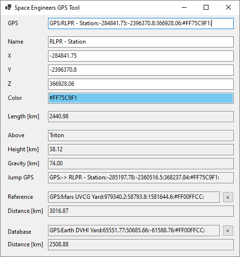

# SEGPS
This is a small tool for [Space Engineers](https://www.spaceengineersgame.com/) to edit in-game GPS coords easily.

Use in-game "copy to clipboard" on any of your GPS coords, SEGPS will monitor the clipboard and update automatically.

You now can easily edit the text representation of the coords or any component (name, x, y, z, color) individually.

Double-click the content in the GPS field to update your clipboard, then paste to in-game chat or use "new from clipboard" in the in-game GPS overview.

Besides the individual components SEGPS will also show you:
- The length of the coord vector (distance from origin)
- The closest planet and the height (radius) from planet center
- The radius of the planet's gravity-well

If the coords are within gravity, SEGPS will calculate a "Jump GPS" approach vector just outside the gravity but straight above your target. Double click here to load this into clipboard. In-game use "new from clipboard" and search for the prefix "->".

Once a coord is loaded, you can use that as a reference point by pressing the "<" button next to the reference field. For any future coords, SEGPS will calculate the distance from there to the reference.
